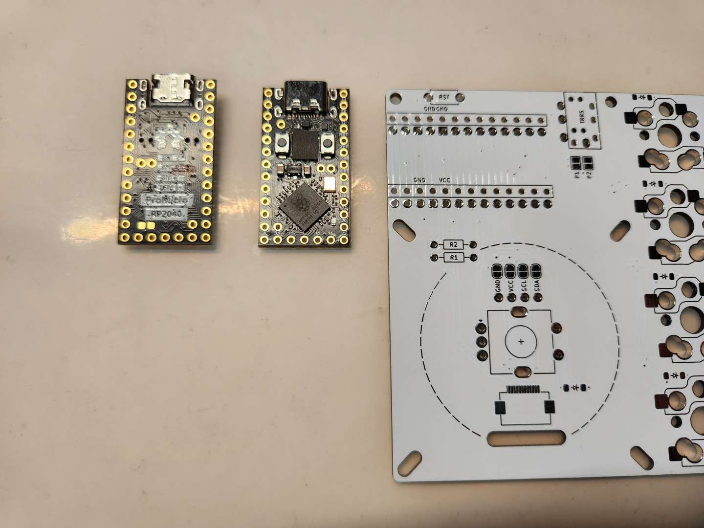

# 組裝環節

## 基本安裝順序

### 二極體

1N4148是機械鍵盤上最常使用到的二極體元件，有分為SMD貼片式及THT直插式，這裡我們使用到的為貼片式，方向對應如下圖：

貼片式二極體相當的微小，需要用鑷子稍微轉動光線才會將它方向展示出來，我們首先的第一步就是將二極體安裝在鍵盤上頭合計25個位置上：

### 熱插拔座

二極體固定完成之後再來焊接固定熱插拔座：

探索者3號支援的熱插拔座有Choc及GLP兩種版本，請擇一安裝即可，對應的腳位如下圖：

安裝完畢後請將TRRS下方的跳線P1連接起來。

> **Notice**
>
> P1為預設的TRRS的電源連接方案，ATMega32U4 ProMicro及RP2040 ProMicro基本都是使用這個方案。

> **Warning**
> 
> 若RP2040 ProMicro出現左右兩側鍵盤上的通信問題，請將P1上的焊錫移除後改至P2再做通信測試。

### MCU

接著將MCU準備好，並且依照電路板上的標示框及上頭的VCC、GND對應、晶片面朝下安裝。

針腳可以選擇直插式或可插拔的款式，為了方便測試照片示意圖會是可插拔的版本，大家參考一下即可。

下一步將TRRS座及2pin的輕觸開關安裝上去（只需安裝單側的話請跳過此步驟）。

## 選配安裝部分

### Cirque 40mm觸控板模組

### 旋鈕編碼器

