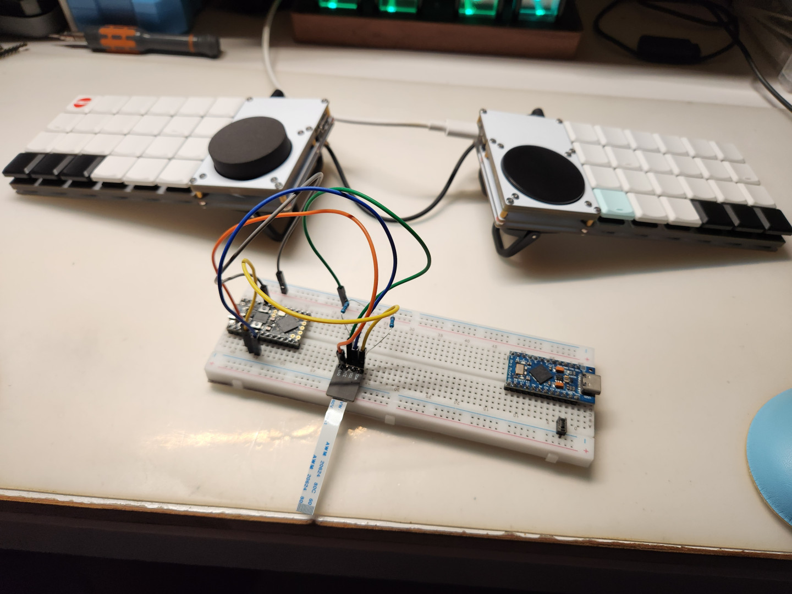

# 開發日誌

## 起因

我本人因為眼疾的關係差不多休息了1年左右的時間，距離上一把鍵盤Prime52做好到現在也同樣過了許久。於是2024年的7月，在鍵人谷群組聊天時突然想試試手，做一把簡單的鍵盤練習，於是就想到用Plank作為範本進行製作，還真的沒有思考太多，也因為這樣，就這麼開始了這個計劃。

雖然還是被吐槽：你說簡單的鍵盤，真的很簡單嗎？

## 雙面矮軸footprint

說是以Plank為基礎，但我每天看著桌子前方的MX軸軸罐也不是辦法，因為自己用矮軸也用了一陣子，也無法切換回去，有一天我點開KiCAD整理我個人的lLibrary跟footprint資料庫的時候，順手畫出了這個Choc及GLP矮軸雙面電路板支援的footprint。

我沒想到這個東西這麼好看，於是就這樣加在自己的原理圖及PCB設計裡，鍵盤PCB就慢慢地成型了。

## 出線口

MCU跟TRRS的出線口我一直有在研究，怎麼個出線方向對應到什麼設備的位置，一開始還是有想說要按照大眾的設計——MCU放置在雙手中間的位置、USB口朝前，但後來看到X社群（舊名twitter）中有人發佈了一個筆電的配置讓我全面改觀，它將筆電架高，分離式鍵盤分別在筆電的左右兩側。

看似毫不起眼的擺放方式，但我就覺得USB出線口要在外側比較方便類似筆電這樣的配置，TRRS座維持前方出線... 也就是說，我一開始的設計是這樣的：

單邊右側的鍵盤，USB出線口也在右側邊，反之亦然。

於是我就就根據MCU側放的方式，開始了鍵盤設計，於是在雙面支援上大致參照了自己的想法，畫出了自己的雙面MCU footprint。每畫還好，畫了發現這個footprint在走線交錯上做的相當完美，而且MCU也只會偏移2.54mm而已

MCU設計好之後，後來發現側放會導致鍵盤會出現一個佔比很大的區塊是完全空白的，於是我想了一下，想到我的資料庫中有個之前畫好沒用上的Cirque 40mm觸控板的footprint，就這樣探索者3號就基本成型了。

## 觸控板

我第一次認識Cirque家的觸控板是在Bastardkb家的Dilemma，它同樣也是使用這款40mm的觸控板，於是我從Dilemma的github頁用google搜尋，就這麼查到beekeeb上的購買頁面。

當時的我只知道這裡有在賣這個，後來就真的計劃先從這裡先買2組回家來用麵包板測試，下面就是測試過後的產物：

也實際拿著到手的實體進行測量，並且搭配Cirque的規格書把它的3D模型建立起來：

我是真的沒想到會這麼多人關注這把不起眼的鍵盤，但後來得知是這塊觸控板的關係。其實我對這類型的電子零件還真的沒轍，也不是專業，我甚至不知道I2C跟SPI是什麼類型的通信方式，只知道看著規格書上的安裝方式安裝。

反正大家喜歡就好，而且矮軸也慢慢的有廠家開始做起來，選擇也慢慢多了，剛好這個節骨眼我把這把鍵盤做出來分享。

謝謝大家。

