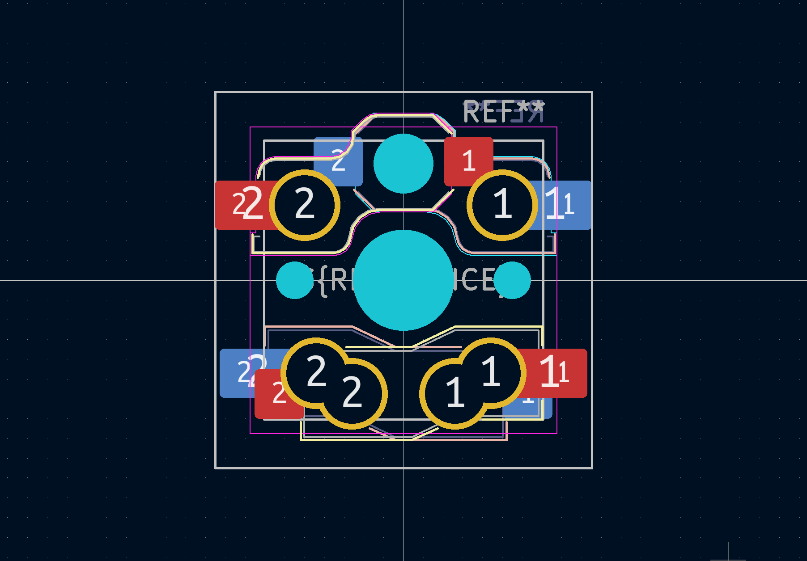
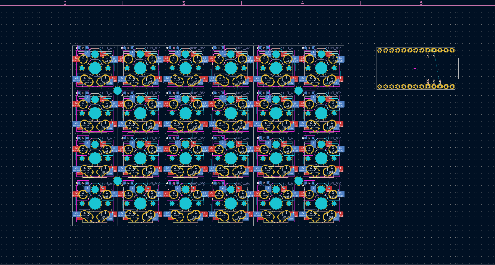
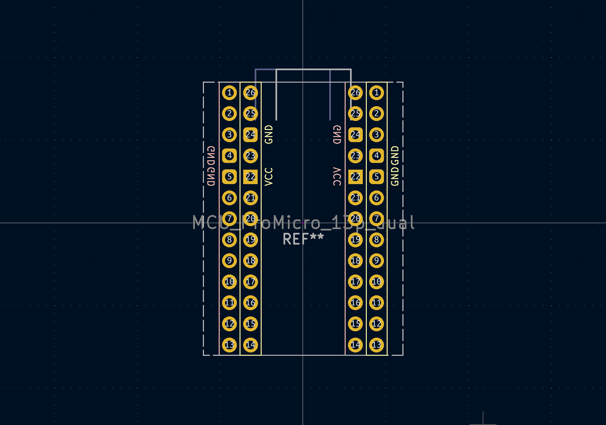
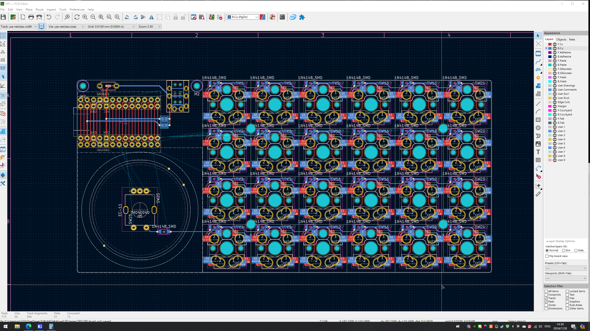
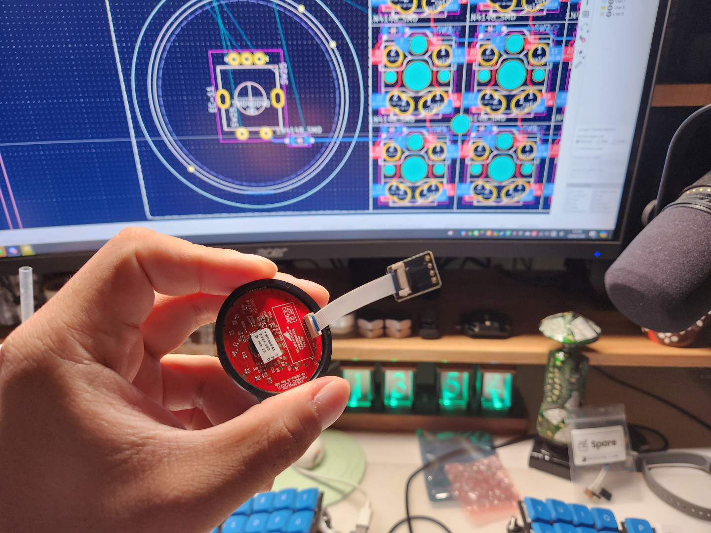
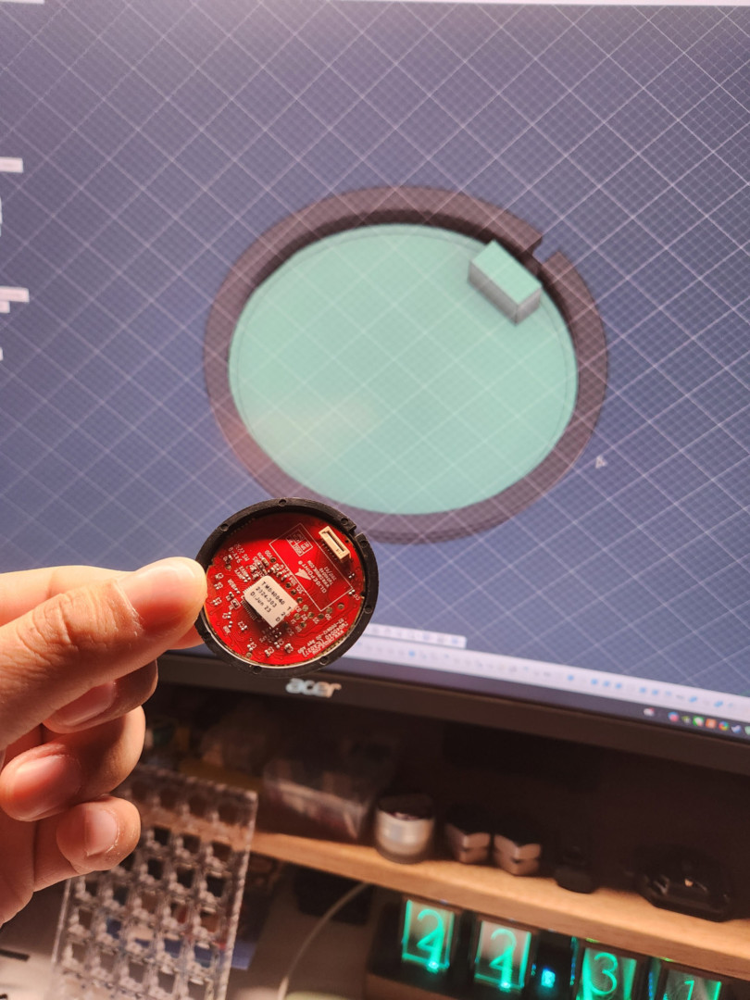
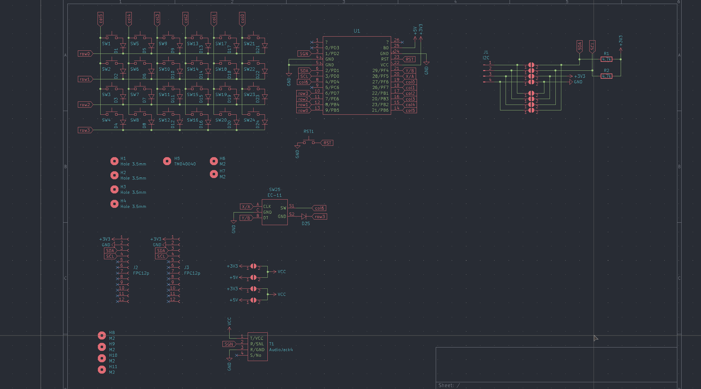
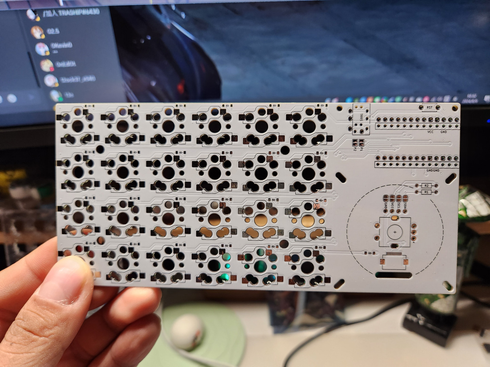

# Changelog

## The Cause

I myself have been taking a break for about a year due to an eye disease, and it's been a long time since I made my last keyboard, the Prime52. In July 2024, I was chatting in the 鍵人谷 group and suddenly wanted to try my hand at a simple keyboard, so I thought of using the Plank as a model, and I didn't really think too much about it, and that's how I started this project.

Although I was still spat at: ‘ Is it really simple board?

## Dual-sided footprint

It is said to be based on Plank, but it is not a solution for me to look at the MX switches cans in front of my desk every day, because I have been using the low profile ones for a while, and I can't change them back. One day, when I started to open KiCAD to edit my personal Library and footprint database, I drew this Choc and GLP low profile double sided board support footprint.

I didn't think it would look so good, so I added it to my schematic and PCB design, and the keyboard PCB slowly took shape.

## Outlet

I've been studying the MCU and TRRS jacks to see how the direction of the jacks corresponds to the position of the device. At first I was thinking of following the popular design - MCU in between the hands, USB port facing forward, but then I saw someone in the X community (known as twitter) post a laptop configuration that made me change my mind. 

Seems like an unremarkable placement, but I thought it would be easier to have the USB ports on the outside of a laptop like this, with the TRRS jacks maintaining the front side of the cables... In other words, this is how I designed it from the beginning:

With a single right-side keyboard, the USB port is also on the right side, and the reverse is also true.

So I started the keyboard design according to the way the MCU is placed on the side, and drew my own double-sided MCU footprint on the double-sided PCB support, roughly following my own ideas. it was fine without drawing it, but after drawing it I realised that the footprint is quite perfect in terms of the wiring crossings, and that the MCU will only be moved by 2.54mm.

After designing the MCU, I found that placing it on its side would cause the keyboard to have a large area that was completely empty, so I thought about it for a while, and realised that I had an unused footprint of a Cirque 40mm touchpad in my database, and that's how the beybaord basically came into being.

## Trackpad

The first time I learnt about Cirque's trackpad was from Bastardkb's Dilemma, which also uses this 40mm trackpad, so I googled it from the Dilemma's github page, and found it on beekeeb. At that time, I only knew that this is sold here, then I really plan to buy 2 packs from here to test it with breadboard at home, here is the product after testing:

Here's what I got after testing: !

I also took measurements of the actual object and built a 3D model of it with Cirque's specification:

I really didn't expect so much attention to this humble keyboard, but I found out that it's the trackpad that's the reason. In fact, I really have no idea about this type of electronic parts, and I'm not a professional, I don't even know what type of communication method I2C and SPI are, I just know how to install it by looking at the installation method on the specification book.

Anyway, as long as you like it, and the short axes are slowly starting to be made by some manufacturers, and there are slowly more choices, so it's good that I've made this keyboard to share at this time.

Thank you all.

