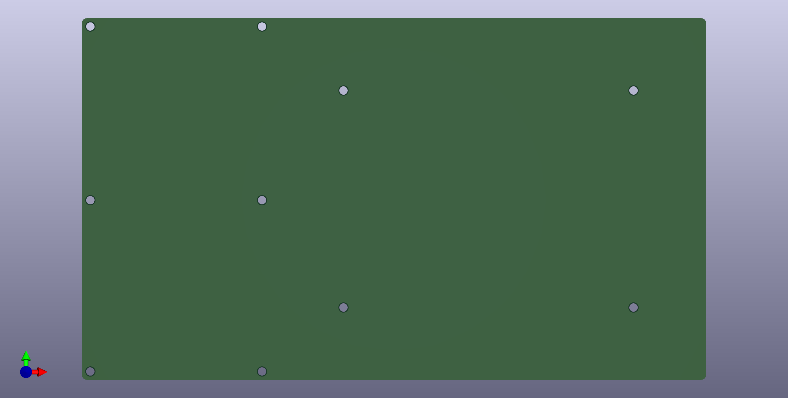
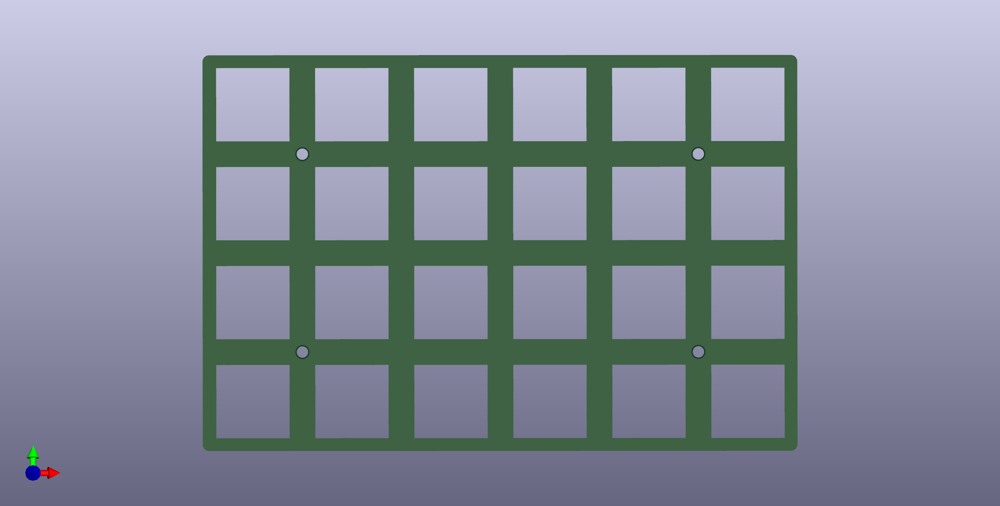
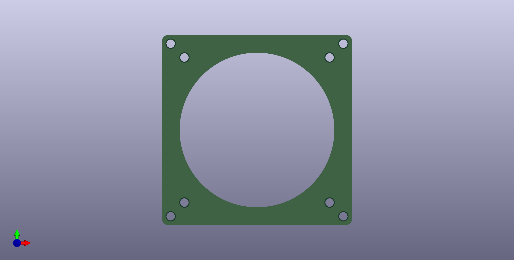
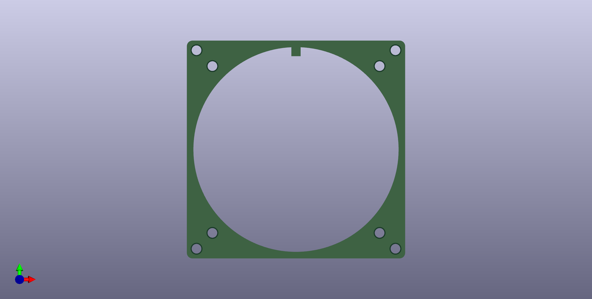
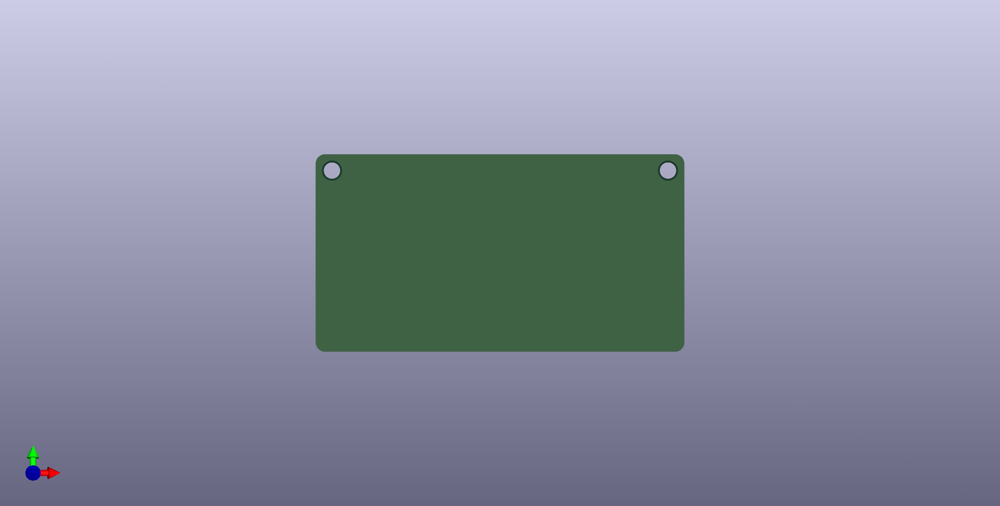

# Explorer Keyboard Blank 探索者3號

## 開發者前言

Plank，是大部分人入坑人體工學鍵盤時最常接觸到的鍵盤，因為它方且正，許多的人體工學鍵盤的基礎都是在這個方正的鍵盤上延伸；

Blank，翻譯成中文的意思為空白。結合了Plank所需要的基礎，進而把鍵盤拓展成可分離的版本，你可以只使用單側、也可以使用兩側、可以在你需要的那一側加裝自己需要的特殊元件，也可以將元件放置在手的左或右側...

並且支援Kailh矮軸Choc v1、v2、Gateron矮軸GLP雙熱插拔，選擇自己所喜歡的按鍵軸及鍵帽——

因此將它歸為探索者系列，稱之為Blank，稱之為3號。

## 靈感來源

- 我只是想做一把簡單的鍵盤。
- 開發上一把鍵盤時發現我最多只需要2顆旋鈕。
- 不想思考太多。
- 突然想到自己曾經在beekeeb上看到Cirque 40mm的觸控板模組。
- 試試看做個能同時翻面支援的電路板好了。

如果想知道完整的開發過程，請詳細閱讀[開發日誌](log.md)中的內文。

## 前置作業

### 電路板

|正面||
|--|--|
|背面||

### 外殼

|底板||
|--|--|
|定位板||
|固定板A||
|固定板B||
|固定板C||
|主控擋板||

### 使用工具

### 使用材料

### 注意事項

## 無私的感謝

### 工具軟體
- KiCAD version 7.0.5。
- Autodesk Fusion。
- QMK、VIAL。

### 規格書
- TM040040 Trackpad。
- Resistor_THT。
- molex 781271110 0.5 FPC CONN.
- ALPS EC11、EC12E。

### 商家及廠家
- 太豪股份有限公司。
- 凱華電子有限公司。
- nuphy及Gateron。
- beekeeb。
- Keycapsss。
- JLCPCB。

