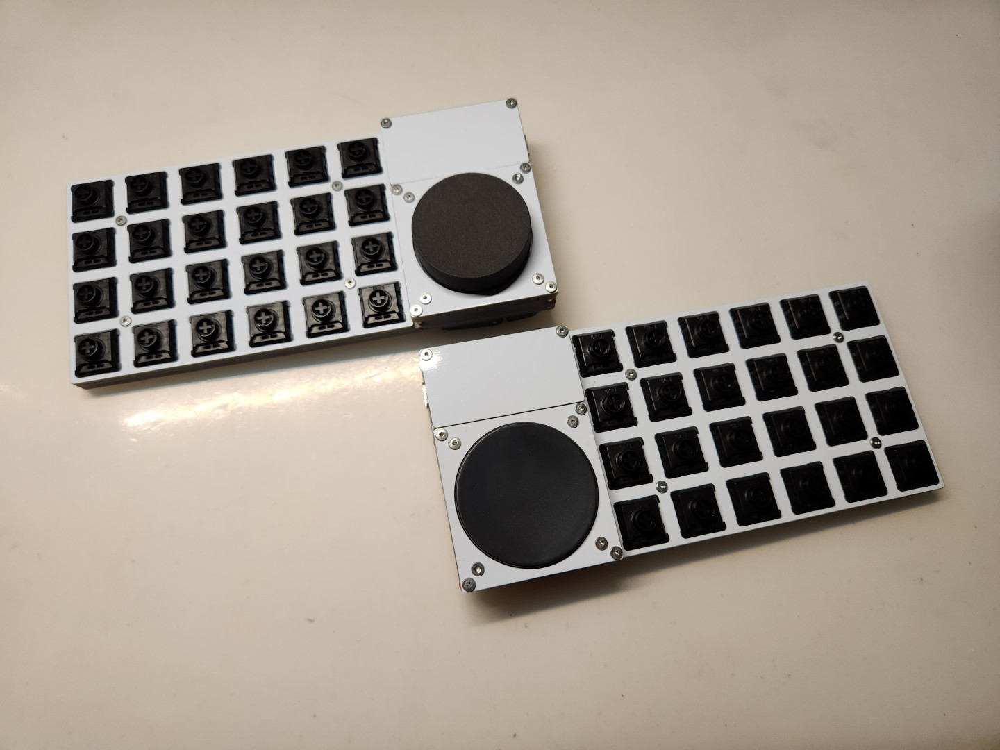
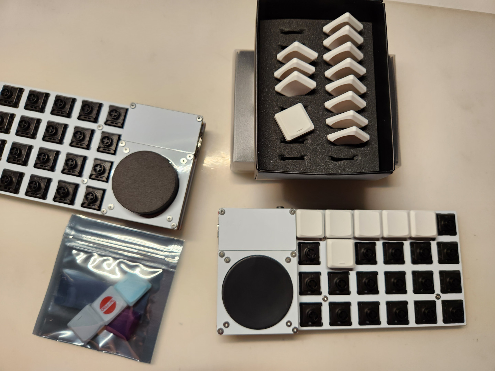
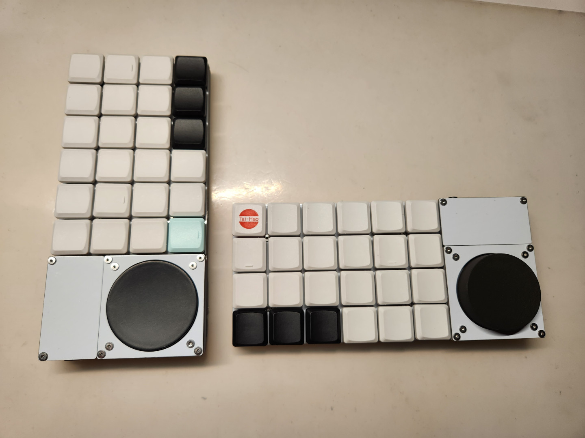
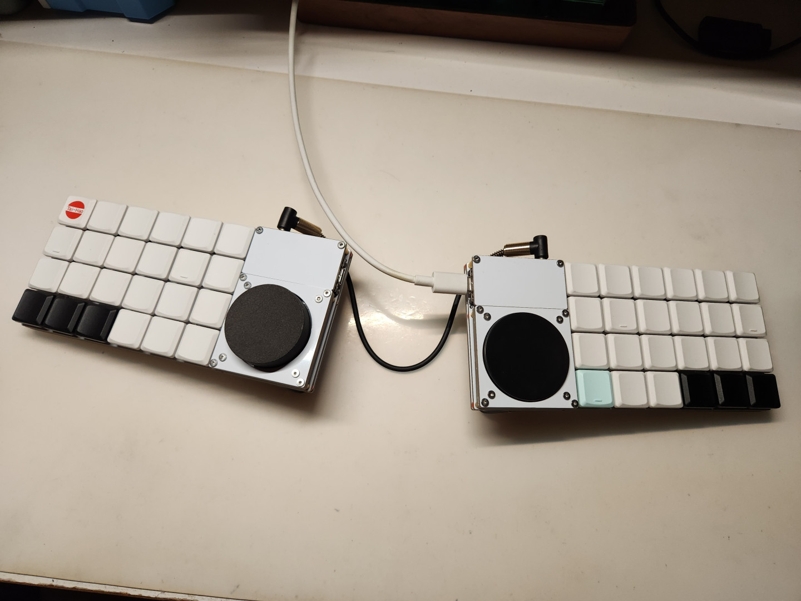
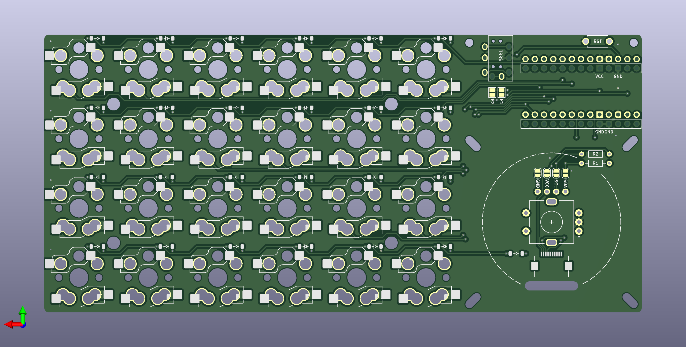

# Explorer Keyboard Blank 探索者3號

|||
|--|--|
|||

## 開發者前言

Plank，是大部分人入坑人體工學鍵盤時最常接觸到的鍵盤，因為它方且正，許多的人體工學鍵盤的基礎都是在這個方正的鍵盤上延伸；

Blank，翻譯成中文的意思為空白。結合了Plank所需要的基礎，進而把鍵盤拓展成可分離的版本，你可以只使用單側、也可以使用兩側、可以在你需要的那一側加裝自己需要的特殊元件，也可以將元件放置在手的左或右側...

並且支援Kailh矮軸Choc v1、v2、Gateron矮軸GLP雙熱插拔，選擇自己所喜歡的按鍵軸及鍵帽——

因此將它歸為探索者系列，稱之為Blank，稱之為3號。

## 靈感來源

- 我只是想做一把簡單的鍵盤。
- 開發上一把鍵盤時發現我最多只需要2顆旋鈕。
- 不想思考太多。
- 突然想到自己曾經在beekeeb上看到Cirque 40mm的觸控板模組。
- 試試看做個能同時翻面支援的電路板好了。

如果想知道完整的開發過程，請詳細閱讀[開發日誌](log.md)中的內文。

## 前置作業

### 電路板

|正面||
|--|--|
|背面||

### 外殼

|底板||
|--|--|
|定位板||
|固定板A||
|固定板B||
|固定板C||
|MCU擋板||

### 會使用到的工具

|名稱|備註|詳細說明|
|--|--|--|
|電烙鐵|-|焊錫、助焊劑等相關工具組|
|防靜電鑷子|-|用於微調貼片元件使用|
|金屬鑷子|-|用於測試電路用|
|加熱台|選配|用於固定貼片元件使用|
|熱風槍|選配|用於固定貼片元件使用|

### 使用材料（單側組裝）

|-|名稱|數量|備註|詳細說明|
|--|--|--|--|--|
||PCB|1|-|雙面通用|
||外殼|1|-|左右通用|
|*|`ProMicro`|1|同腳MCU都可|推薦使用`RP2040`版本|
|*|二極體 `1N4148`|25|-|`SMD`貼片式|
|*|熱插拔座|24|`Choc`、`GLP`|二選一|
||`2pin`輕觸開關|1|-|-|
|*|M2螺絲墊片|10|-|穩固鍵盤結構使用|
||M2x`8mm` 扁頭螺絲|6|-|-|
||M2x`6mm` 扁頭螺絲|8|-|-|
||M2x`4mm` 扁頭螺絲|4|-|-|
||M2x`3mm` 扁頭螺絲|6|-|-|
||M2螺母|10|-|-|
||M2x`8mm` 雙通銅柱|8|-|-|
||M2x`5mm` 雙通銅柱|4|-|-|
||M2x`4mm` 雙通銅柱|4|-|-|
||`ø8mm` `H1mm` 矽膠自黏腳貼|4|-|-|
|*|`Cirque` `40mm`觸控板|1|選配|推薦帶`曲面`之版本|
||`FFC` `12pin` 排線連接座|1|選配|如有`I2C轉接座`可不需使用|
|*|`FFC` `12pin` 軟排線|1|選配|`正對正接口`、`50mm`長即可|
|*|`4.7K` 上拉電阻|2|選配|`THT`直插式，安裝觸控板才需要使用|
|*|旋鈕編碼器|1|選配|`EC11`、`EC12`擇一使用；`L：10mm`、`A：4.5-5.0mm`，推薦`半軸` `D型`|
|*|旋鈕編碼器帽蓋|1|選配|`ø39mm`、`軸孔深4.5mm`特製版，推薦3D列印|
||`3.5mm` `TRRS`座|2|選配|單側安裝不需使用|

探索者3號支援各大網路商家販售的Cirque 40mm的觸控板模組拓展包，裡頭基本一應俱全，可考慮直接從通路購買：

- [40mm Cirque GlidePoint Circle Trackpad Module DIY Kit for Split Mechanical Keyboard](https://shop.beekeeb.com/product/40mm-cirque-glidepoint-circle-trackpad-module-diy-kit-for-split-mechanical-keyboard/)
- [GlidePoint Cirque Trackpad TM040040 TM035035](https://keycapsss.com/keyboard-parts/parts/211/glidepoint-cirque-trackpad-tm040040-tm035035)

### 注意事項

1. 上面表列材料表為`單片電路板安裝使用`。
2. 列表前標記`*`的材料為極度重要之零組件，請留意是否準備齊全，參照如下：

    - 二極體`1N4148`及`熱插拔座`請務必準備齊全，否則鍵盤會無法正常使用。
    - 旋鈕`編碼器`需搭配`帽蓋`一起安裝。
    - Crique 40mm`觸控板`需搭配`4.7k上拉電阻`、`12pin軟排線`安裝，缺一不可，請特別留意。
    - `M2螺絲墊片`務必準備齊全，有關鍵盤整體的`結構`，務必安裝上去。
 
3. 機械鍵軸務必跟隨熱插拔座的規格進行購買，因為`Choc跟GLP規格不相容`。
4. 使用電烙鐵時務必留意`環境通風`、`用電安全`及`燙傷預防`。
5. 在進入組裝環節之前，務必先將beekeeb及Keycapsss的組裝流程看過一輪：

    - [Cirque Trackpad i2c on Corne Keyboard Build Log](https://beekeeb.com/cirque-trackpad-i2c-on-corne-keyboard/)。
    - [GlidePoint Cirque Trackpad with Adapter PCB](https://keycapsss.com/help/cirque-trackpad/#spi-or-i2c)。

環境及材料都準備完畢之後，就可以開始進入[組裝環節](guide.md)了。

## 無私的感謝

### 工具軟體
- [KiCAD](https://www.kicad.org/) version `7.0.5`。
- [Autodesk Fusion](https://www.autodesk.com/products/fusion-360/free-trial)。
- [QMK](https://qmk.fm/)、[VIAL](https://get.vial.today/)。

### 規格書
- [TM040040 Trackpad](spc/TM040040.pdf)。
- [Resistor_THT](spc/Resistor_THT.png)。
- [molex 781271110 0.5 FPC CONN.](spc/FPC-Conn-781271110.pdf)。
- ALPS [EC11](<spc/Rotray Encoder EC11.pdf>)、[EC12E](<spc/Rotray Encoder EC12E.PDF>)。

### 商家及廠家
- [太豪股份有限公司](https://www.tai-hao.com/tw/)。
- [凱華電子有限公司](http://www.kailh.com/index.html)。
- [nuphy](https://nuphy.com/)及[Gateron](https://www.gateron.co/)。
- [beekeeb](https://shop.beekeeb.com/)。
- [Keycapsss](https://keycapsss.com/)。
- [JLCPCB](https://jlcpcb.com/)。

