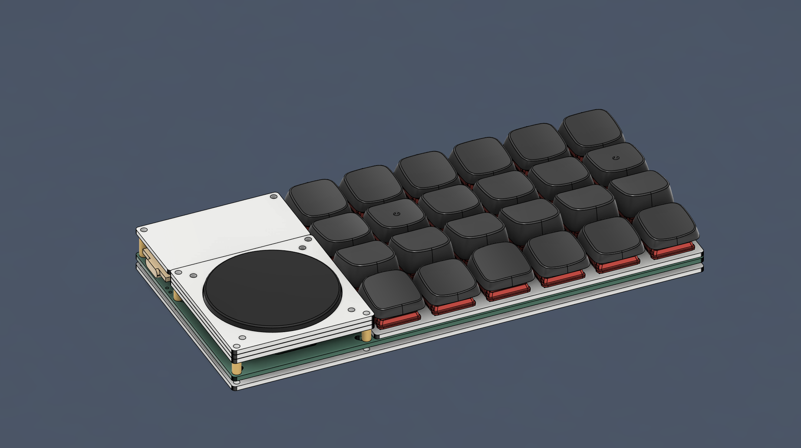
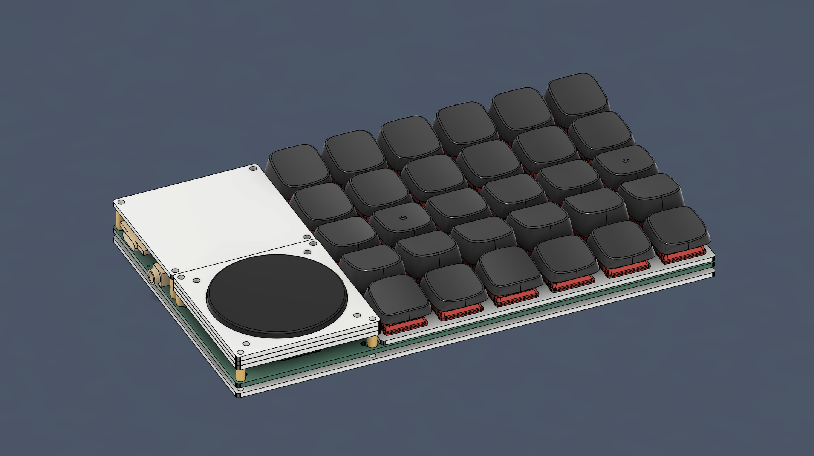
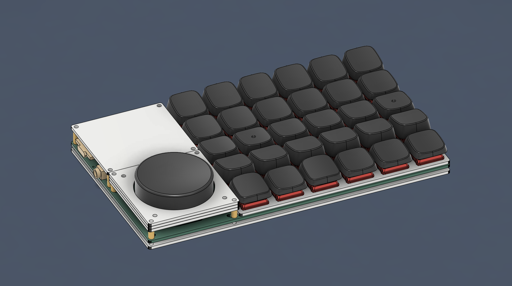

# Explorer Keyboard Blank

|4x6|5x6|
|--|--|
|||
|||
|||
|||

## Foreword

Plank, is the most common keyboard most people come across when they get into ergonomic keyboards, because it is square and square, and the foundation of many ergonomic keyboards is extended on this square keyboard;

Blank, it means empty or nothing. By combining the basics needed for the Plank, the keyboard is expanded into a split version, where you can use only one side, or both sides, add your own special features to the side you need, or place the features on the left or right side of the hand...

And it supports Kailh Choc v1, v2, Gateron GLP dual hot-swapping, choose your favourite keycaps and keyswitches - it's a great way to get the most out of the Explorer series!

Therefore it is classified as Explorer series, called Blank, and called No.3.

## Inspiration

- I just wanted to make a simple keyboard.
- Developed my last keyboard and realised I only needed 2 knobs at most.
- I didn't want to think too much about it.
- Suddenly I remembered that I saw a Cirque 40mm trackpad module on beekeeb.
- I'll try to make a PCB that can be flipped to support both sides at the same time.

If you want to know the complete development process, please read the [Changelog](log_en.md) in detail.

## Pre-building

### PCB

||4x6|5x6|
|--|--|--|
|Front Side|||
|Back Side|||

### Case

||4x6|5x6|
|--|--|--|
|Bottom|||
|Plate|||
|Cover A|||
|Cover B|||
|Cover C|||
|Cover MCU|||

### Tools to be used

|Name|Note|Detail|
|--|--|--|
|Soldering Iron|-|Soldering iron, flux and other related tools|
|Tweezers|-|For the SMD components|
|Metal Tweezers|-|For testing electronic circuits|
|Hot Plate|Optional|For the SMD components|
|Heat Gun|Optional|For the SMD components|

### Material list (one side assembly)

|4x6|5x6|
|--|--|
|||
|||

|-|Name|Amount|Amount|Note|Detail|
|--|--|--|--|--|--|
|||**4x6**|**5x6**|||
||PCB|1|-|-|Left and Right can be flipped, Order `1.6mm` thickness|
||Case|1|-|-|Left and Right can be flipped, Order `1.6mm` thickness|
|*|Plate|1|-|-|Left and Right can be flipped, Order `1.2mm` thickness|
|*|`ProMicro`|1|-|The MCU have similar pins|Recommanded to use `RP2040` version|
|*|Diode `1N4148`|25|31|-|`SMD`|
|*|Hot-swap socket|24|30|`Choc` and `GLP`, choose one to use||
||`2pin` Tactile Switch|1|-|-|-|
|*|M2 Washer|6|-|-|Stable keyboard construction for use|
||M2x`8mm` Screw|6|-|-|-|
||M2x`6mm` Screw|8|-|-|-|
||M2x`4mm` Screw|4|6|-|-|
||M2x`3mm` Screw|6|-|-|-|
||M2 Nuts|10|-|-|-|
||M2x`8mm` Spacer|2|4|-|-|
||M2x`5mm` Spacer|8|-|-|-|
||`ø8mm` `H1mm` Cushion rubber|4|-|-|-|
|*|`Cirque` `40mm` Trackpad|1|-|Optional|Recommand to use the version with `Curve Overlay`|
||`FFC` `12pin` Connector|1|-|Optional|No needed if you have `I2C adapter`|
|*|`FFC` `12pin` Flexible Cable|1|-|Optional|`Cable and Cable on the same side`, `50mm` length|
|*|`4.7K` Pull-up Resistor|2|-|Optional|`THT`, if you need to install trackpad|
|*|Rotray Encoder (Knob)|1|-|Optional|`EC11` and `EC12`, choose one to use; `L: 10mm`, `A: 4.5-5.0mm`, recommanded `Half-type` or `D type`|
|*|The Cap|1|-|Optional|`ø39mm`、`Hole Depth 4.5mm` special edition, recommended 3DP|
||`3.5mm` `TRRS Jack`|1|2|Optional|No needed when you build only one keyboard|

The Explorer No.3 supports the Cirque 40mm trackpad module expansion kit, which is sold by various online stores, and has basically everything you need, so consider buying it directly from the stores:

- [40mm Cirque GlidePoint Circle Trackpad Module DIY Kit for Split Mechanical Keyboard](https://shop.beekeeb.com/product/40mm-cirque-glidepoint-circle-trackpad-module-diy-kit-for-split-mechanical-keyboard/)
- [GlidePoint Cirque Trackpad TM040040 TM035035](https://keycapsss.com/keyboard-parts/parts/211/glidepoint-cirque-trackpad-tm040040-tm035035)

### Attentions

1. The material list above is for `Single PCB Installation`.
2. The materials marked with `*` in front of the list are extremely important components, please pay attention to whether you have prepared all of them or not, please refer to the following:

    - Diode `1N4148` and `hot-swap sockets` must be prepared, otherwise the keyboard will not work properly.
    - The knob `Encoder` needs to be installed together with the `Cap`.
    - Crique 40mm `touchpad` needs to be installed with `4.7k pull-up resistor` and `12pin flexible cable`, please pay special attention to it.
    - `M2 screw washers` must be prepared and mounted on `the whole structure` of the keyboard.
 
3. The mechanical keyswitches must follow the specification of the hot-swap sockets, because `Choc` is not compatible with `GLP` specification.
4. Pay attention to `environmental ventilation`, `electrical safety`, and `burn prevention` when using soldering irons.
5. Go through the guide of beekeeb and Keycapsss before you start the building guide:

    - [Cirque Trackpad i2c on Corne Keyboard Build Log](https://beekeeb.com/cirque-trackpad-i2c-on-corne-keyboard/).
    - [GlidePoint Cirque Trackpad with Adapter PCB](https://keycapsss.com/help/cirque-trackpad/#spi-or-i2c).

After the environment and materials have been prepared, you can start the [building guide](guide_en.md).

## Selfless Thanks

### Softwares
- [KiCAD](https://www.kicad.org/) version `7.0.5`.
- [Autodesk Fusion](https://www.autodesk.com/products/fusion-360/free-trial).
- [QMK](https://qmk.fm/)、[VIAL](https://get.vial.today/).

### Datasheets
- [TM040040 Trackpad](spc/TM040040.pdf).
- [Resistor_THT](spc/Resistor_THT.png).
- [molex 781271110 0.5 FPC CONN.](spc/FPC-Conn-781271110.pdf).
- ALPS [EC11](<spc/Rotray Encoder EC11.pdf>)、[EC12E](<spc/Rotray Encoder EC12E.PDF>).

### Shops and Manufacturers
- [Tai-hao Enterprise co.](https://www.tai-hao.com/tw/).
- [Kailh Electronics Co.](http://www.kailh.com/index.html).
- [nuphy](https://nuphy.com/) and [Gateron](https://www.gateron.co/).
- [beekeeb](https://shop.beekeeb.com/).
- [Keycapsss](https://keycapsss.com/).
- [JLCPCB](https://jlcpcb.com/).

